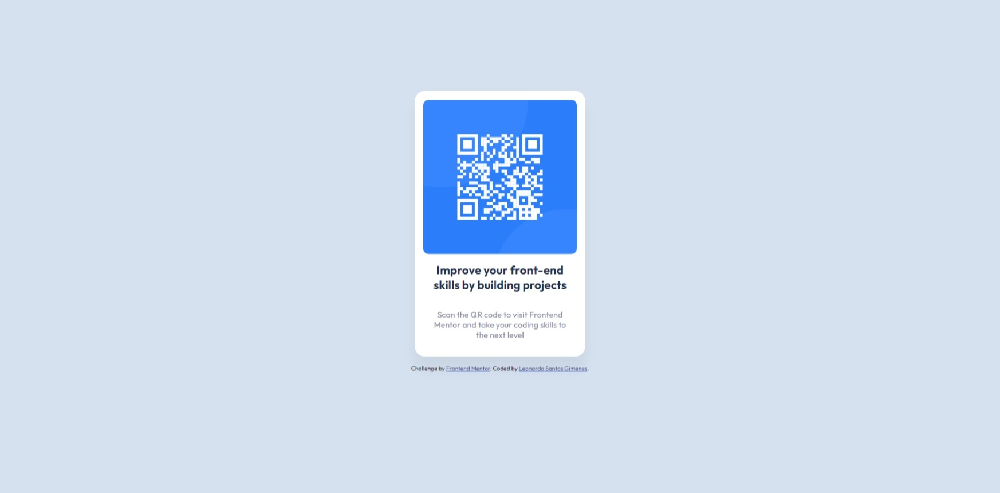

# Frontend Mentor - QR code component solution

This is a solution to the [QR code component challenge on Frontend Mentor](https://www.frontendmentor.io/challenges/qr-code-component-iux_sIO_H). Frontend Mentor challenges help you improve your coding skills by building realistic projects. 

## Table of contents

- [Overview](#overview)
  - [Screenshot](#screenshot)
  - [Links](#links)
- [My process](#my-process)
  - [Built with](#built-with)
  - [Continued development](#continued-development)
- [Author](#author)

## Overview

### Screenshot

### Links

- Solution URL: [Solution](https://github.com/leogimenes/qr-code-component)
- Live Site URL: [QR Code Component](https://leogimenes.github.io/qr-code-component/)

## My process

### Built with

- Semantic HTML5 markup
- CSS custom properties
- Flexbox
- Mobile-first workflow

### Continued development

Better understand the media query concept and how to use it in CSS.
Create images with only CSS or SVG.
Use CSS grid or another form of layout alignment.

## Author

- Website - [Leonardo Santos Gimenes](https://www.linkedin.com/in/leonardo-santos-gimenes/)
- Frontend Mentor - [@leogimenes](https://www.frontendmentor.io/profile/leogimenes)
